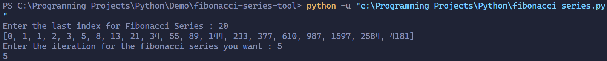

# Fibonacci Series Tool

A Python tool to generate the Fibonacci series and retrieve specific terms from the sequence.


## Features

- Generate the Fibonacci series up to a user-defined number of terms.
- Retrieve the Fibonacci number at a specific position.

---

## Getting Started

### Prerequisites

Ensure you have Python 3.x installed on your system.

### Running the Script

1. Clone the repository:
   ```bash
   git clone https://github.com/adnaanzshah/fibonacci-series-tool.git
   cd fibonacci-series-tool
2. Run Code
   ```bash
   python fibonacci-series-tool.py

---



*A visualization of the Fibonacci series.*

---
